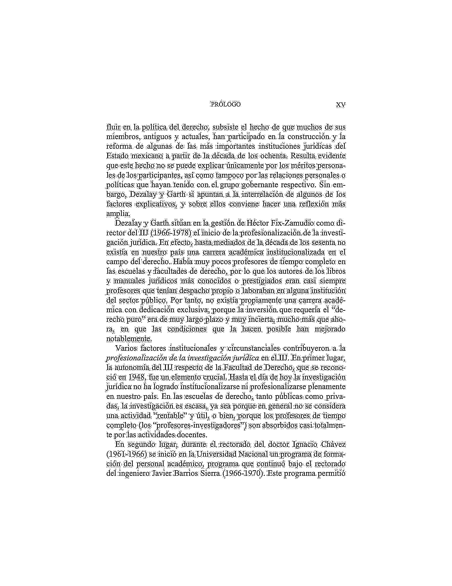

# PDF Text Extraction with OpenCV and AI

## Project Overview
This project is designed to extract text from images within PDF files using Python, OpenCV, and AI. The primary goal is to convert images to text, allowing for easy data extraction and analysis. The project offers both traditional OCR (using Tesseract) and AI-powered text extraction (using GPT-4).

## Installation
1. Clone the repository:
   ```bash
   git clone <repository-url>
   ```
2. Navigate to the project directory:
   ```bash
   cd pdf_text_opencv
   ```
3. Install the required dependencies:
   ```bash
   pip install -r requirements.txt
   ```
4. Set up your OpenAI API key (for AI-powered extraction):
   ```bash
   export OPENAI_API_KEY=your_api_key_here
   ```

## Usage
### Traditional OCR Method
- Run the main script to process images and extract text using Tesseract:
  ```bash
  python main.py
  ```

### AI-Powered Method
- Run the AI extraction script to process images using GPT-4 Vision:
  ```bash
  python ai_text_extraction.py
  ```
- The AI method typically provides better accuracy and formatting preservation.

## Features

### OpenCV Preprocessing
OpenCV is utilized for preprocessing images extracted from PDFs. It enhances image quality to improve text extraction accuracy. The preprocessing includes:
- Converting images to grayscale
- Applying histogram equalization
- Gaussian blurring
- Adaptive thresholding

### AI-Powered Text Extraction
The project now includes GPT-4 Vision integration that offers:
- Superior text recognition accuracy
- Better handling of complex layouts
- Automatic error correction
- Preservation of document formatting
- Multi-language support
- Table structure recognition

## Function Descriptions

1. **`convert_pdf_to_text(pdf_path)` in `main.py`**:
   - Converts a PDF file into images using `pdf_to_images`
   - Extracts text from these images using `images_to_text`
   - Returns the extracted text

2. **`pdf_to_images(pdf_path, dpi=300, output_folder="page_jpegs")` in `image_splitter.py`**:
   - Converts each page of a PDF into a JPEG image
   - Saves images in the specified output folder
   - Calls `preprocess_image` to enhance each image

3. **`preprocess_image(image_path)` in `image_splitter.py`**:
   - Reads an image and converts it to grayscale
   - Enhances contrast using CLAHE
   - Applies Gaussian blur to reduce noise
   - Uses adaptive thresholding for binary image creation
   - Saves the preprocessed image for OCR

4. **`images_to_text(images_folder="page_jpegs")` in `image_to_text.py`**:
   - Reads preprocessed images from a folder
   - Uses Tesseract OCR to extract text from each image

5. **`process_images(images_folder="page_jpegs", output_folder="page_text_ai")` in `ai_text_extraction.py`**:
   - Processes preprocessed images using GPT-4 Vision
   - Provides high-quality text extraction with preserved formatting
   - Saves results in the specified output folder

## Output
- Traditional OCR results are saved in the `page_text` directory
- AI-powered extraction results are saved in the `page_text_ai` directory
- Each page is saved as a separate text file with preserved formatting

## File Descriptions
- `main.py`: The main script to run the text extraction process.
- `image_to_text.py`: Contains functions to convert images to text using OCR.
- `image_splitter.py`: Handles splitting images if necessary for processing.
- `ai_text_extraction.py`: Contains functions for AI-powered text extraction using GPT-4 Vision.
- `requirements.txt`: Lists all Python dependencies required for the project.

## Dependencies
- Python 3.x
- OpenCV
- Tesseract OCR (ensure it's installed and configured on your system)
- OpenAI API (for AI-powered extraction)

## Notes
- Ensure that Tesseract OCR is correctly installed on your system for the text extraction to work.
- Adjust the scripts as necessary to fit your specific PDF and image processing needs.
- For AI-powered extraction, make sure to set up your OpenAI API key.

## Example: Page 14

Below is an example of the preprocessed image and the extracted text for Page 14 of the document.

### Preprocessed Image


### Extracted Text File
The extracted text is saved in the file: [Page_014.txt](page_text/Page_014.txt)
